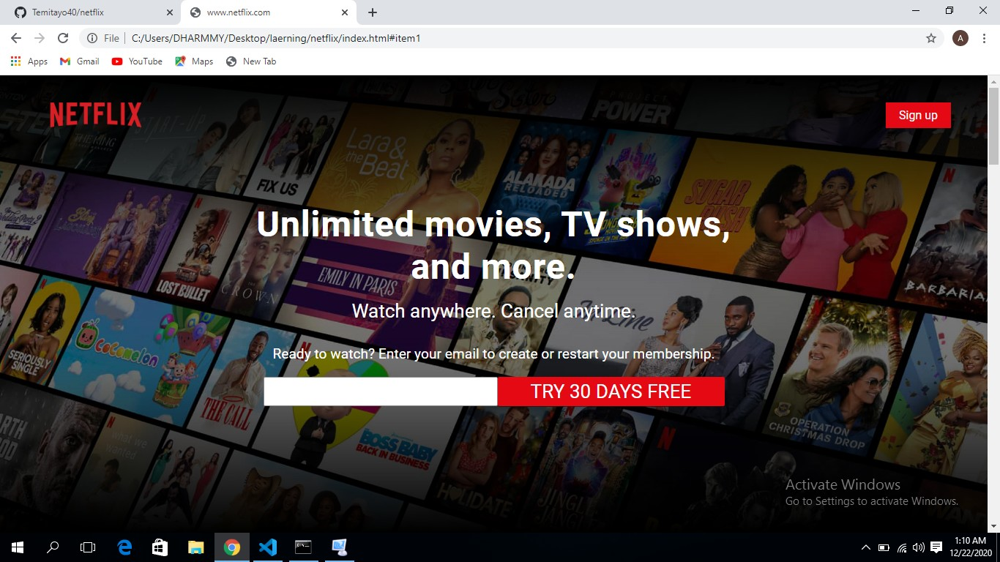
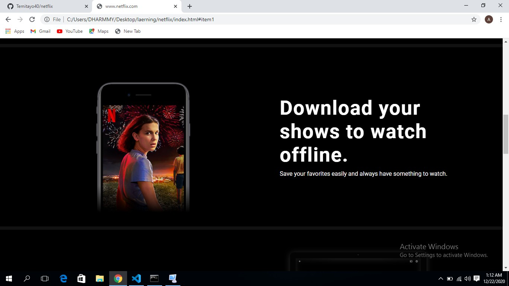

# NETFLIX HOME PAGE

This is a webpage project that focuses on developing a Netflix Home page.
   
 
  

The aim of this project is to develop the Netflix Home Webpage . The contents are personalized and the design specifications were obtained [here](https://www.odinsproject.com).

## Built with
  * HTML 
  * CSS (Bootstrap)

  

## Live demo
[Live Demo Link](https://rawcdn.githack.com/Temitayo40/netflix/da9556dde0d1f723ea51772a5c5b728abdc2530f/index.html)

## Getting started
**I created a website a cloned from Netflix Home page. The design specifications were gotten from [ordinproject.com](https://www.ordinsproject.com). The project consist of one working pages (including navigation bar, body and footer) with a display of system view**

## Authors
 **Author:**
 * Name: Adebowale Damilola
 * [Github](https://github.com/Temitayo40/)
 * [Twitter](https://twitter.com/Adebowa30361993)

## Show your support
Give a :star: if you like this project!

## Acknowledgements

  * [The Odin Project](https://www.theodinproject.com/courses/html5-and-css3/lessons/embedding-images-and-video#introduction)
 
 

## License
 Distributed under the MIT License.